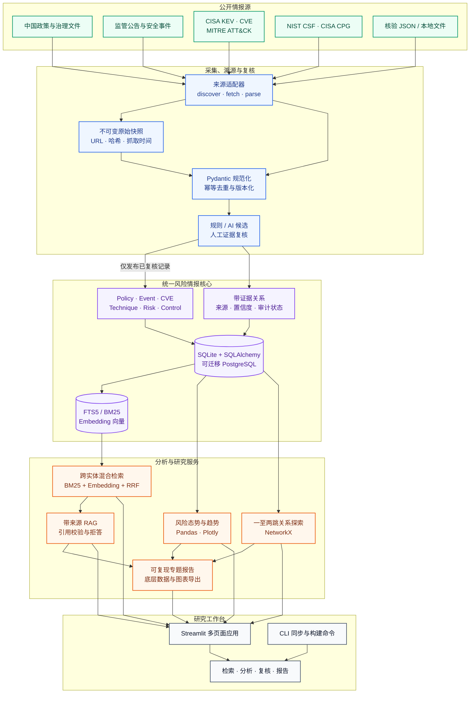

# CyberRisk Intel 系统架构

该图展示公开情报从采集、溯源、规范化和人工复核，到统一存储、跨实体检索、趋势分析、关系探索及研究输出的完整数据流。

```mermaid
%%{init: {"flowchart": {"curve": "linear", "nodeSpacing": 28, "rankSpacing": 42}}}%%
flowchart TB
    subgraph sources["公开情报源"]
        direction LR
        policy["中国政策与治理文件"]
        incident["监管公告与安全事件"]
        threat["CISA KEV · CVE<br/>MITRE ATT&CK"]
        control["NIST CSF · CISA CPG"]
        import["核验 JSON / 本地文件"]
    end

    subgraph pipeline["采集、溯源与复核"]
        direction LR
        adapters["来源适配器<br/>discover · fetch · parse"]
        provenance["不可变原始快照<br/>URL · 哈希 · 抓取时间"]
        normalize["Pydantic 规范化<br/>幂等去重与版本化"]
        review["规则 / AI 候选<br/>人工证据复核"]
    end

    subgraph core["统一风险情报核心"]
        direction LR
        entities["Policy · Event · CVE<br/>Technique · Risk · Control"]
        relations["带证据关系<br/>来源 · 置信度 · 审计状态"]
        database[("SQLite + SQLAlchemy<br/>可迁移 PostgreSQL")]
        index[("FTS5 / BM25<br/>Embedding 向量")]
    end

    subgraph intelligence["分析与研究服务"]
        direction LR
        retrieval["跨实体混合检索<br/>BM25 + Embedding + RRF"]
        analytics["风险态势与趋势<br/>Pandas · Plotly"]
        relation_graph["一至两跳关系探索<br/>NetworkX"]
        rag["带来源 RAG<br/>引用校验与拒答"]
        reports["可复现专题报告<br/>底层数据与图表导出"]
    end

    subgraph access["研究工作台"]
        direction LR
        ui["Streamlit 多页面应用"]
        cli["CLI 同步与构建命令"]
        analyst["检索 · 分析 · 复核 · 报告"]
    end

    policy --> adapters
    incident --> adapters
    threat --> adapters
    control --> adapters
    import --> adapters
    adapters --> provenance
    adapters --> normalize
    provenance --> normalize
    normalize --> review
    review -->|仅发布已复核记录| entities
    review --> relations
    entities --> database
    relations --> database
    database --> index
    index --> retrieval
    database --> analytics
    database --> relation_graph
    retrieval --> rag
    analytics --> reports
    relation_graph --> reports
    rag --> reports
    retrieval --> ui
    analytics --> ui
    relation_graph --> ui
    rag --> ui
    reports --> ui
    ui --> analyst
    cli --> analyst

    classDef source fill:#ECFDF5,stroke:#059669,color:#064E3B,stroke-width:1.5px;
    classDef process fill:#EFF6FF,stroke:#2563EB,color:#1E3A8A,stroke-width:1.5px;
    classDef data fill:#F5F3FF,stroke:#7C3AED,color:#4C1D95,stroke-width:1.5px;
    classDef analysis fill:#FFF7ED,stroke:#EA580C,color:#7C2D12,stroke-width:1.5px;
    classDef interface fill:#F8FAFC,stroke:#475569,color:#0F172A,stroke-width:1.5px;
    class policy,incident,threat,control,import source;
    class adapters,provenance,normalize,review process;
    class entities,relations,database,index data;
    class retrieval,analytics,relation_graph,rag,reports analysis;
    class ui,cli,analyst interface;
```
